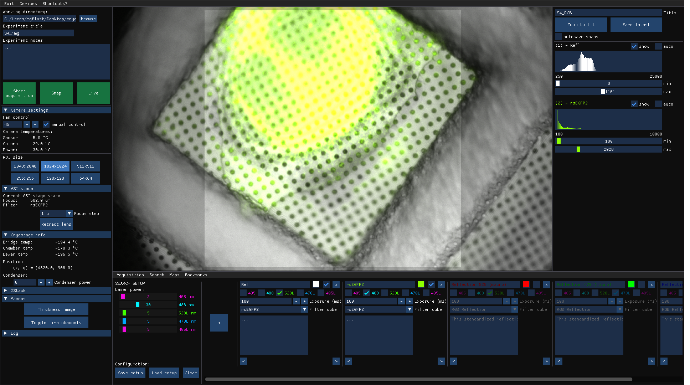

# cryoscope

Cryoscope is the acquisition software written in Python for the control of our cryogenic super-resolution fluorescence microscope. The main interface can be seen in the image below.

__We make the code available with the hope that parts of it find use outside of our laboratory.__ However, the full software is currently not readily usable outside of our lab due to the following reasons:
* Primarily, this software was written for internal use. The code is not very Pythonic or conform to PEP guidelines (particularly early code). The structure of the software is a bit chaotic: an initial architecture was planned out, but later improvements were improvised on top of that.
* The cryostage driver makes use of a proprietary sdk by Linkam Scientific Instruments Ltd., for which a user license is required (note: we can unfortunately also not make the sdk available here). 
* Drivers were also written with the goal of being useful for our setup, and not in a generic fashion that is easily ported into another codebase. Drivers are standalone .py files, which are imported into other scripts as modules, and contain functions only (rather than methods as part of, e.g., an abstract 'XYStage' class). Each driver module contains a 'Connect()' or 'Init()' function which is written in a manner that (probably) makes it specific to our hardware (e.g., the Connect() function in LightHUB.py, the laser driver, makes use of hard-coded hardware serial numbers that tell which COM port corresponds to which laser channel). In order to be able to use our software in your own setup, the drivers would probably have to be edited.

To emphasize: we hope that by uploading this work, we can be of some help to others who are looking to write/use drivers for various hardware components that we also use in our setup (e.g. ASI stage controller, Linkam Cryostage, Omicron light sources, pco camera, transistor-transistor logic (TTL) hardware triggered acquisition with Arduino) or use OpenGL with imgui to write similar software. 

The user interface was made using pyimgui, the python wrapper for the imgui GUI library, with OpenGL as the backend. 

If you do wish to use the full cryoscope software, the following information may be useful:
- Parameters for the GUI appearance (colors, feature sizes and locations, etc.) are defined in GUI_Config.py
- Hardware parameters (e.g. microscope magnification, camera sensor size, etc.) and variables that can be changed during runtime (e.g. requested filter position, working directory, etc.) are defined in Parameters.py
- communicationProtocol.ino is the code uploaded to the Arduino and defines the communication protocol used between the PC and Arduino. For example, the function 'void ParseAcquisitionInput()' defines how an acquisition setup string, sent by the PC when executing the function AcquireStart() in AcquisitionControl.py, is interpreted.
- AcquisitionControl.py contains code to define how a user-defined acquisition setup is sent to the Arduino in order to start hardware-triggered acquisition. DataControl.py is the module that controls incoming data (e.g. the camera's image stream) and saves it.
- Simplified overview of the structure of the code: all of the GUI is defined in GUI_Modules.py. GUI_Modules.py talks to AcquisitionControl.py to control the microscope, and to DataControl.py to ensure data is saved properly. AcquisitionControl.py talks to the drivers (GUI_Modules does as well, to get some values such as the actual sample temperature). Various other files (e.g. Input.py, Channels.py, Bookmark.py) handle other specific tasks and are used in GUI_Modules.py as well.

### Software features
* Long, high framerate super-resolution acquisition (hours, at up to 20-50 images per second depending on ROI size) + a simple user interface to graphically set up an efficient, hardware-triggered acquisition routine.
* Sample stage and focus stage control
* Temperature monitoring
* Parallel 'live' and 'acquisition' multi-channel acquisition setups
* Region of interest bookmarking
* Overview maps (large field of view, stitched images - work in progress)
* ZStacks
* Minimal-clutter GUI and control shortcuts.  

### Hardware used
* Sample stage: CMS196 (Linkam Scientific Instruments Ltd., Surrey, United Kingdom)
* Focus stage: LS-50 (ASI Applied Scientific Instrumentation, Eugene, Oregon, United States)
* Filter stage: C60-CUBE-SLDR (ASI Applied Scientific Instrumentation, Eugene, Oregon, United States)
* Focus and filter stage controller: MS1 ((ASI Applied Scientific Instrumentation, Eugene, Oregon, United States)
* Laser source: LightHUB w\ 405, 488, and 532 nm laser diodes (Omicron-Laserage Laserprodukte GmbH, Rodgau-Dudenhogen, Germany)
* LED source: LedHUB w\ 365, 405, 470, and 528 nm diodes (Omicron-Laserage Laserprodukte GmbH, Rodgau-Dudenhogen, Germany)
* Camera: pco.edge 4.2 (Excelitas PCO GmbH, Kelheim, Germany)
* Objective lens: TU Plan APO Epi 100x 0.9 NA (Nikon Europe B.V., Amsterdam, Netherlands)
* Tube lens: C60-TUBE-B (ASI Applied Scientific Instrumentation, Eugene, Oregon, United States)
* Acquisition control board: Arduino Leonardo
* Acquisition PC: Intel Precision 3640 workstation w\ Intel i9-10900K CPU and NVIDIA Quadro P2200 GPU

### Dependencies
* glfw (pyGLFW 2.4.0)
* imgui 1.4.1 (pyimgui 1.4.0)
* numpy 1.21.4
* OpenGL (PyOpenGL 3.1.5)
* pco 0.1.6 (note: version 0.1.6 is not yet on pypi. This version is required to be able to set the camera acquisition triggering mode to 'external')
* Pillow 8.4.0
* pyserial 3.5
* tkinter 
* pickle

_Author/contact: m.g.f.last@lumc.nl_